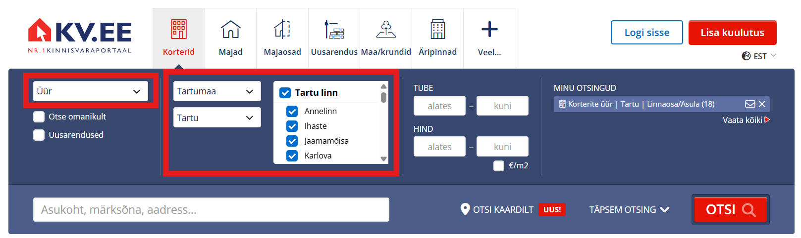
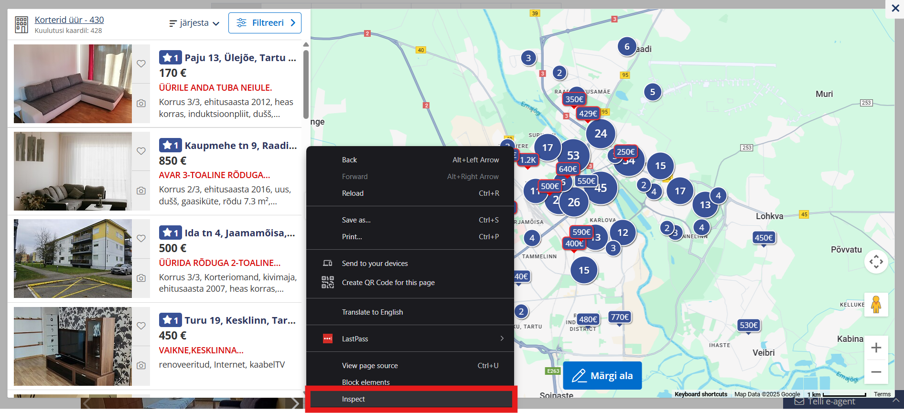
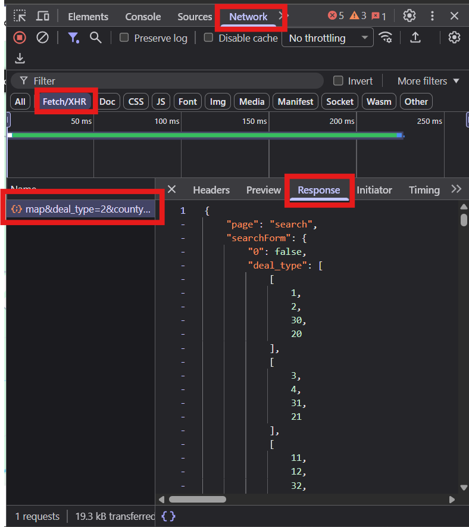

# Real Estate Pricerange Predictor

This project aims to set up a algorithm, that, when given a city's real estate data, can predict priceranges in any given xy coordinate within the citys boarders. This project was created in for a Tartu University CS class.

- [Real Estate Pricerange Predictor](Real-Estate-Pricerange-Predictor)
  - [Getting Started](Getting-Started)
    - [Scraping Data Example](Scraping-Data-Example)
      - [Manual Scraping](Manual-Scraping)
    - [Prerequisites](Prerequisites)
    - [Authors](Authors)

## Getting Started

This project uses data gathered from KV.ee specifically, but if youre willing to do your own data cleaning, other websites can be used as well.

### Scarping Data Example

Our data was scraped from KV.ee, the most popular real estate website in Estonia. The manual guide down below will work for all citys: the way the website is built, makes it hard to scrap data from smaller citys, since there are so many and each has their own id, which is very timeconsuming to gather up.

Note: We did try automating the scraping process with a script, but after some concideration (and some time fucking around and finding out) we decided to scrap the scrapper (see what I did there), since the websites api is blocking our requests for the data, thus making the script unethical use of brute force.

#### Manual Scraping

1. Go to KV.ee.
2. For type, choose rent (_Üür_), Then choose any city youd like to get data on.
   
3. Open "Search from the map" (_Otsi kaardilt_) and inspect the element.
   
4. From there, choose Network and Fetch/XHR. There you should see a line along the lines of "map&deal_type=2...". If there are multiple of them, choose the lowest, as it should be the latest. Click on it and then choose "Response".
   
5. Then just ctrl+A, ctrl+C and paste the whole thing into a .json file.

### Prerequisites

!Requirements for this project include:

- Python
- Jupyter Notebook

## Authors

- **Karl Martin Puna** (GnuThe2nd)
- **Daniel Trump** (Daniloom)
- **Mari Lee Lumberg** (lumbergmarilee)
